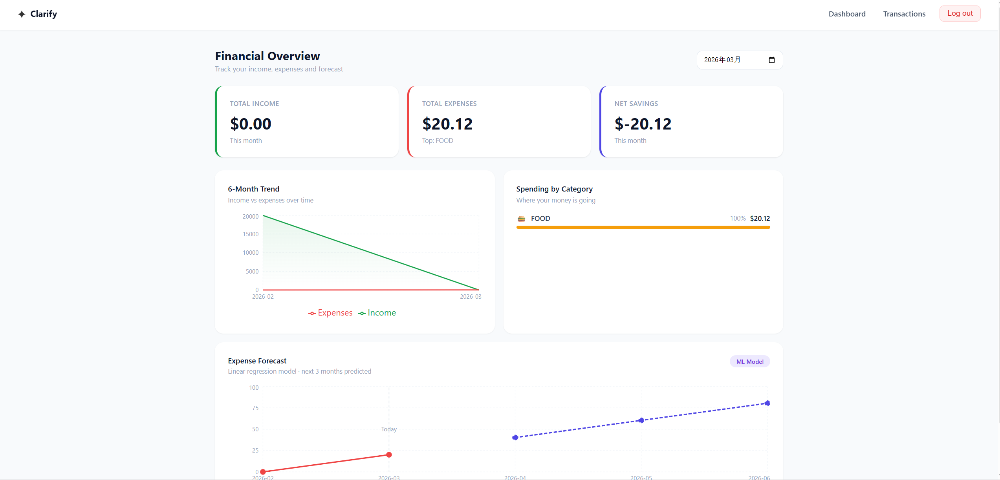
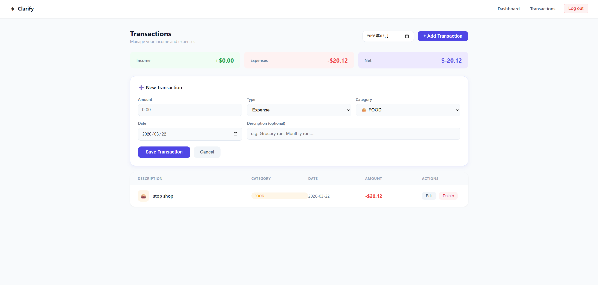
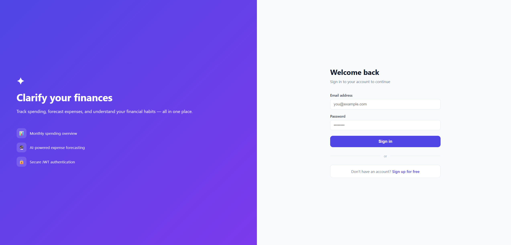
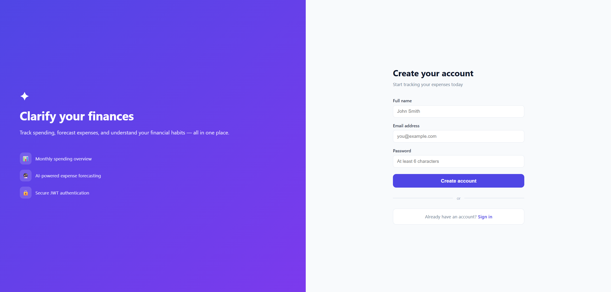

# Clarify — Frontend
🌐 **Live Demo**: https://clarify-frontend-production.up.railway.app

> React + TypeScript frontend for Clarify, a personal finance app with dashboard analytics, transaction management, and ML-powered expense forecasting.

## Tech Stack

| Layer | Technology |
|---|---|
| Language | TypeScript |
| Framework | React 18 |
| Routing | React Router v6 |
| HTTP Client | Axios |
| Charts | Recharts |
| Styling | CSS-in-JS (inline styles) |

## Features

- **Authentication** — Login and registration with field-level error messages
- **Dashboard** — Monthly income/expense summary, category breakdown, 6-month area chart
- **Transactions** — Table view with add, edit, delete and month filter
- **Expense Forecast** — Line chart showing historical expenses and predicted future spending
- **Protected Routes** — Automatic redirect to login if JWT token is missing or expired

## Screenshots

> Dashboard


> Transactions


> Login


> Sign up


## Getting Started

### Prerequisites
- Node.js 18+
- [Clarify Backend](https://github.com/YuxiLuoGood/clarify-backend) running on `http://localhost:8080`

### Run locally

```bash
git clone https://github.com/YuxiLuoGood/clarify-frontend.git
cd clarify-frontend
npm install
npm start
```

The app will open at `http://localhost:3000`.

## Project Structure

```
src/
├── api/
│   └── client.ts       → Axios instance with JWT interceptor
├── pages/
│   ├── LoginPage.tsx
│   ├── DashboardPage.tsx
│   └── TransactionsPage.tsx
├── types/
│   └── index.ts        → TypeScript interfaces
├── App.tsx             → Routes and protected route logic
└── index.css           → Global styles
```

## Backend

The Spring Boot REST API is available at [clarify-backend](https://github.com/YuxiLuoGood/clarify-backend.git).